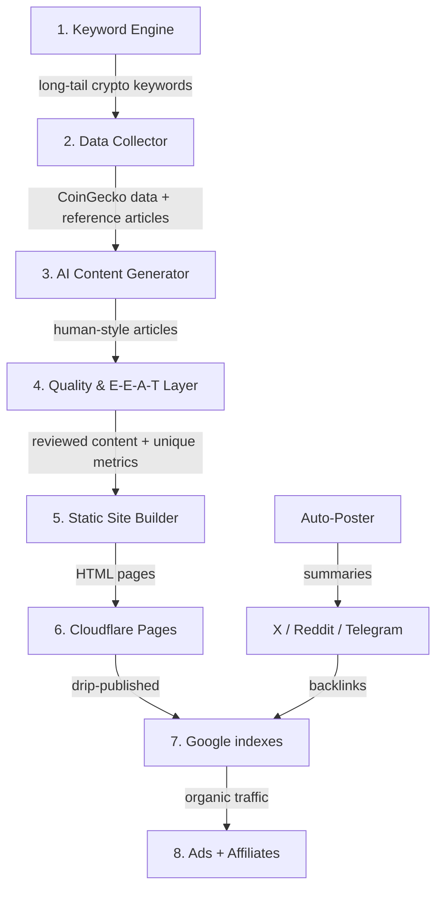

# TokenRadar.co — Comprehensive Project Reference

> **Project:** Crypto Programmatic SEO Platform
> **Domain:** tokenradar.co ($6.98/yr on Namecheap)
> **AI Provider:** Gemini 3.1 Flash Lite (primary) + Claude Haiku 4.5 (fallback)
> **Token Range:** #50-#250 by market cap, expanding to #500
> **Total 6-Month Cost:** ~$30
> **Status:** Live in production

---

## Table of Contents

1. [Project Overview](#project-overview)
2. [System Architecture](#system-architecture)
3. [Tech Stack](#tech-stack)
4. [Project Structure](#project-structure)
5. [Phase 1 — Keyword Research Engine](#phase-1--keyword-research-engine)
6. [Phase 2 — Data Collection](#phase-2--data-collection)
7. [Phase 3 — AI Content Generation](#phase-3--ai-content-generation)
8. [Phase 4 — E-E-A-T & Quality Layer](#phase-4--e-e-a-t--quality-layer)
9. [Phase 5 — Website Build](#phase-5--website-build)
10. [Phase 6 — Automated Social Promotion](#phase-6--automated-social-promotion)
    - [X (Twitter) Setup](#x-twitter-setup)
    - [Telegram Setup](#telegram-setup)
    - [YouTube Shorts Setup](#youtube-shorts-setup)
    - [Troubleshooting: invalid_grant](#troubleshooting-invalid_grant)
11. [Phase 7 — Monetization](#phase-7--monetization)
12. [Phase 8 — Automated Content Refresh](#phase-8--automated-content-refresh)
13. [Content & Cost Schedule](#content--cost-schedule)
14. [Build Timeline](#build-timeline)
15. [Risk Mitigation](#risk-mitigation)
16. [Legal & Compliance](#legal--compliance)
17. [Domain & Branding Research](#domain--branding-research)
18. [AI Provider Comparison](#ai-provider-comparison)
19. [Token Strategy](#token-strategy)

---

## Project Overview

TokenRadar.co is a **programmatic SEO platform** that auto-generates thousands of high-quality, data-driven articles about cryptocurrency tokens. The platform targets **long-tail keywords** with low competition to capture organic search traffic, then monetizes via Google AdSense and crypto affiliate programs.

### Core Value Proposition

- **Unique proprietary metrics** (Risk Score, Growth Potential Index) — not just regurgitated CoinGecko data
- **AI-generated content** that reads like human-written analysis
- **Massive scale** — 1,500+ articles in 6 months at near-zero cost
- **Auto-updating data** — prices and metrics refresh daily via GitHub Actions

### Why This Works

1. **Long-tail keywords** have low competition — major sites focus on BTC/ETH
2. **Mid-cap tokens (#50-#200)** are searched but under-served by quality content
3. **Static site generation** means near-zero hosting costs and blazing-fast pages
4. **Programmatic content** scales linearly while cost stays flat

---

## System Architecture



### Data Flow

```
CoinGecko API → Raw Data (JSON) → Metric Computation → AI Prompt Assembly
→ Claude Haiku → Raw Article → Quality Check → Markdown/JSON
→ Next.js SSG → HTML → Cloudflare Pages → Google Index
```

---

## Tech Stack

| Layer | Technology | Cost |
|-------|-----------|------|
| **Framework** | Next.js (App Router, SSG) | $0 |
| **Language** | TypeScript (strict mode) | $0 |
| **Hosting** | Cloudflare Pages | $0 |
| **CDN** | Cloudflare (built-in) | $0 |
| **CI/CD** | GitHub Actions | $0 (2,000 min/month free) |
| **Data API** | CoinGecko Free Tier | $0 (10K calls/month) |
| **AI Content** | Gemini 3.1 Flash Lite (primary) + Claude Haiku 4.5 fallback | ~$0.001 / article |
| **AI Summaries** | Gemini 3.1 Flash Lite (primary) + Claude Haiku 4.5 fallback | $0 |
| **Domain** | Namecheap (tokenradar.co) | $6.98/yr |
| **Charts** | Recharts (lightweight) | $0 |
| **Social APIs** | X API + Telegram Bot API (`grammy`) | $0–$5 |

---

## Project Structure

```
tokenradar/
├── src/
│   ├── app/
│   │   ├── layout.tsx                # Global nav, footer, AdSense, cookie banner
│   │   ├── page.tsx                  # Homepage: top tokens, trending, latest
│   │   ├── about/page.tsx            # E-E-A-T: About + methodology
│   │   ├── privacy/page.tsx          # Privacy policy (GDPR)
│   │   ├── terms/page.tsx            # Terms of service
│   │   ├── disclaimer/page.tsx       # Financial disclaimer
│   │   ├── contact/page.tsx          # Contact form/email
│   │   ├── [token]/
│   │   │   ├── page.tsx              # Token overview page
│   │   │   ├── price-prediction/page.tsx
│   │   │   ├── how-to-buy/page.tsx
│   │   │   └── transfer-to-ledger/page.tsx
│   │   ├── upcoming/page.tsx         # Upcoming TGE landing page
│   │   ├── upcoming/[token]/page.tsx # Upcoming token detail pages
│   │   ├── learn/page.tsx            # Glossary / learning hub
│   │   ├── learn/[slug]/page.tsx     # Individual learn pages
│   │   └── robots.ts                 # Robots metadata route
│   ├── components/
│   │   ├── PriceChart.tsx            # Lightweight chart (recharts)
│   │   ├── RiskScoreCard.tsx         # Proprietary metrics display
│   │   ├── AffiliateButton.tsx       # Exchange referral CTA
│   │   ├── LastUpdated.tsx           # Timestamp component
│   │   └── TokenCard.tsx             # Token summary card for listings
│   ├── lib/
│   │   ├── coingecko.ts              # CoinGecko API client with rate limiting
│   │   ├── config.ts                 # Centralized config (URLs, handles, referrals)
│   │   ├── content-loader.ts         # Load generated content from JSON
│   │   ├── gemini.ts                 # Gemini 3.1 + Claude fallback for AI summaries
│   │   ├── markdown.ts               # Markdown rendering utilities
│   │   ├── reporter.ts               # Error logging + API usage tracking
│   │   ├── telegram.ts               # Telegram Bot API client
│   │   ├── utils.ts                  # Shared utilities (safeReadJson, sleep)
│   │   ├── visitor-fetcher.ts         # Cloudflare analytics fetcher
│   │   └── x-client.ts               # X (Twitter) API v2 client
│   └── video/                        # Remotion video scenes and entrypoints
├── content/                          # Generated articles (JSON)
│   └── tokens/                       # Per-token articles
├── data/
│   ├── tokens.json                   # Token metadata summary
│   ├── tokens/                       # Per-token detail JSON files
│   ├── metrics/                      # Computed proprietary metrics
│   ├── prices/                       # Historical price data cache
│   ├── references/                   # Reference article snippets
│   ├── keywords.json                 # Generated keyword list
│   ├── logs/                         # Error logs (decentralized)
│   └── posted/                       # Social post tracking (daily folders)
├── scripts/
│   ├── keyword-generator.ts          # Phase 1: Keyword research
│   ├── fetch-crypto-data.ts          # Phase 2: CoinGecko data fetcher (--lite / full)
│   ├── fetch-reference-articles.ts   # Phase 2: Reference article scraper
│   ├── generate-content.ts           # Phase 3: AI content generator (Claude)
│   ├── compute-metrics.ts            # Phase 3: Unique metric computation
│   ├── quality-check.ts              # Phase 4: Content quality validation (--fix)
│   ├── post-market-updates.ts        # Phase 6: Market alerts (TG + X)
│   ├── post-daily-poll.ts            # Phase 6: AI-generated TG polls (7 rotating themes)
│   ├── post-daily-movers.ts          # Phase 6: Top 5 Movers image card (TG)
│   ├── post-interactive-daily.ts     # Phase 6: Interactive X polls
│   ├── validate-content.ts           # Prebuild: JSON integrity + conflict markers
│   ├── generate-sitemap.ts           # Prebuild: XML sitemap generation
│   └── send-system-report.ts        # Reporting: Daily/weekly/monthly summaries
├── tests/
│   ├── config.test.ts
│   ├── content-loader.test.ts
│   ├── utils.test.ts
│   └── x-client.test.ts
├── .github/
│   └── workflows/
│       ├── daily-refresh.yml         # Daily data + price refresh + deploy
│       ├── daily-content-generation.yml # Daily queue publish + deploy
│       ├── social-automations.yml    # 12x/day: unified TG/X posting with exclusive slots
│       └── weekly-content-generation.yml # Weekly queue generation
├── .env.example                      # Required environment variables
├── package.json
├── tsconfig.json
├── vitest.config.ts
├── next.config.ts
└── TOKENRADAR.md                     # This file
```

---

## Phase 1 — Keyword Research Engine

**Goal:** Generate 5,000–10,000 long-tail keywords with low competition.

### Long-Tail Targeting Strategy

Avoid head keywords (BTC, ETH) where CoinGecko/Forbes dominate. Target the **long tail** via a **Template × Token Matrix**:

```
Templates:                              Tokens (#50-#200 by market cap):
├── "[token] price prediction 2026"     ├── Mid-cap tokens (lower competition)
├── "is [token] a good investment"      ├── New trending tokens (< 6 months old)
├── "[token] vs [token]"                ├── DeFi / Layer 2 / AI narrative tokens
├── "how to buy [token]"               └── Expand to #200-#500 in month 3+
├── "[token] staking rewards APY"
├── "[token] tokenomics explained"
├── "what is [token] used for"
└── "[token] risks and concerns"
```

### Script: `scripts/keyword-generator.ts`

**Inputs:**
- CoinGecko: tokens #50-#200 (names, symbols, categories)
- Google Autocomplete API: real user search queries

**Process:**
1. Fetch token list from CoinGecko
2. Generate all template × token combinations
3. Query Google Autocomplete with each token + alphabet modifiers (a-z)
4. Deduplicate and filter out keywords dominated by high-authority sites
5. Output sorted by estimated search volume

**Output:** `data/keywords.json` — array of keyword objects with token, template, estimated volume

**Cost:** $0

---

## Phase 2 — Data Collection

### Script: `scripts/fetch-crypto-data.ts`

**Data Source: CoinGecko API (Free Tier)**

| Data Point | Endpoint |
|------------|----------|
| Price, market cap, volume | `/coins/{id}` |
| Circulating / total supply | `/coins/{id}` |
| ATH / ATL with dates | `/coins/{id}` |
| 30-day + 1-year price history | `/coins/{id}/market_chart` |
| Categories and tags | `/coins/{id}` |

**Rate Limit Safeguards:**
- Shared client with caching and a monthly quota counter
- Local JSON cache — re-fetch only if data is **>24h old**
- Monthly call counter — **auto-pause at 9,000 calls** (limit: 10,000)
- Cache-first behavior to reduce unnecessary repeat calls

**Output:** `data/tokens.json` + `data/prices/[token-id].json`

### Script: `scripts/fetch-reference-articles.ts`

**Sources:** CoinDesk, The Block, Decrypt (via RSS feeds)

**Process:**
1. Fetch RSS feeds for each token name
2. Extract **key facts and analysis angles only** (not full text — avoids copyright)
3. Store as summarized reference points

**Purpose:** AI uses these as **style and fact reference**, never copies content directly.

**Output:** `data/references/[token-id].json`

---

## Phase 3 — AI Content Generation

### Provider: Gemini 3.1 Flash Lite (Primary) + Claude Haiku 4.5 (Fallback)

| Metric | Value |
|--------|-------|
| Cost per article | ~$0.001 (0.1 cents) |
| Input token price | $0.075 / 1M tokens |
| Output token price | $0.30 / 1M tokens |
| Reliability | Dual-model fallback system |

### Script: `scripts/generate-content.ts`

Each article prompt includes:
1. **Real CoinGecko data** — prices, market cap, supply, history
2. **Reference article summaries** — writing style + analyst perspectives
3. **Calculated unique metrics** — computed by our scripts, not the AI

### Proprietary Metrics (`scripts/compute-metrics.ts`)

| Metric | Description | Inputs |
|--------|-------------|--------|
| **Risk Score** (1-10) | Overall investment risk | Volatility, market cap, age, liquidity |
| **Growth Potential Index** | Room to grow vs category peers | Market cap vs avg in same category |
| **Holder Concentration** | Whale risk indicator | Top wallet % (on-chain if available) |
| **Narrative Strength** | Category trend momentum | Search trends for AI, DeFi, L2, etc. |
| **Value vs ATH** | Discount from peak | Current price ÷ all-time high |

### Content Rules

- **1,000–2,000 words** per article
- Minimum **3 real data points** from CoinGecko per article
- Minimum **1 real-world event/development** reference
- **FAQ section** (3–5 questions) for Google FAQ rich snippets
- **"Last Updated: [date]"** timestamp on every page
- **No buy/sell recommendations** — data and analysis only
- **Disclaimer footer** on every article

**Output:** `content/tokens/[token-id]/[article-type].json`

---

## Phase 4 — E-E-A-T & Quality Layer

Google's E-E-A-T (Experience, Expertise, Authority, Trust) signals are critical for ranking.

| Signal | Implementation |
|--------|---------------|
| **About page** | Site methodology, data sources, algorithms explained |
| **Author profile** | Named author with bio, photo, social media links |
| **Methodology page** | Detailed explanation of Risk Score, Growth Index formulas |
| **Data citations** | "Data: CoinGecko, as of [date]" on every article |
| **Disclaimer** | "Not financial advice" footer on every page |
| **Privacy Policy** | GDPR-compliant privacy policy |
| **Terms of Service** | Standard terms of service |
| **Cookie consent** | GDPR cookie consent banner |
| **Last Updated** | Visible timestamp on every article |
| **Contact page** | Email address or contact form |

### Quality Check Script: `scripts/quality-check.ts`

Automated validation before publishing:
- Word count within 1,000–2,000 range
- At least 3 CoinGecko data citations
- FAQ section present with 3+ questions
- Disclaimer present
- No prohibited financial advice phrases ("you should buy", "guaranteed returns", etc.)
- Readability score check

---

## Phase 5 — Website Build

### Next.js + Static Site Generation (SSG)

All pages are **pre-rendered at build time** for:
- ⚡ Instant page loads (no server-side rendering costs)
- 🔍 Perfect SEO (full HTML for Google crawlers)
- 💰 Free hosting on Cloudflare Pages

### Key Pages

| Route | Purpose |
|-------|---------|
| `/` | Homepage — top tokens, trending, latest articles |
| `/about` | E-E-A-T: methodology, team, data sources |
| `/privacy`, `/terms`, `/disclaimer` | Legal pages |
| `/contact` | Contact form |
| `/[token]` | Token overview (price, metrics, summary) |
| `/[token]/price-prediction` | Price prediction article |
| `/[token]/how-to-buy` | Step-by-step buying guide |
| `/[token]/transfer-to-ledger` | Token transfer and wallet guidance |
| `/upcoming/[token]` | Upcoming TGE detail page |
| `/sitemap.xml` | Auto-generated sitemap |

### SEO Optimizations

- **Structured data** (JSON-LD) for FAQ, Article, BreadcrumbList schemas
- **Auto-generated sitemap.xml** submitted to Google Search Console
- **IndexNow API** pings on every new page deployment
- **Canonical URLs** on all pages
- **Open Graph + Twitter Card** meta tags
- **Internal linking** between related token pages

### Drip Publishing Schedule

| Period | Pages/Day | Strategy |
|--------|-----------|----------|
| Week 1 | 30 total (seed) | Homepage + top tokens + legal pages |
| Week 2–4 | 10–15/day | Gradually ramp up via GitHub Actions |
| Month 2+ | 20–30/day | Full speed as Google gains trust |

> **Why drip publish?** Publishing 1,000+ pages overnight triggers Google's spam detection. Gradual rollout mimics natural content growth.

---

## Phase 6 — Automated Social Promotion

### Unified Workflow: `.github/workflows/social-automations.yml`

All social posting is consolidated into a single workflow with 12 scheduled runs/day.

| Platform | Content | Frequency | Script |
|----------|---------|-----------|--------|
| **Telegram** | Market Updates | 10x/day | `post-market-updates.ts --platform telegram` |
| **Telegram** | Daily Poll (AI, 7 rotating themes) | 1x/day @ 14:30 UTC | `post-daily-poll.ts` |
| **Telegram** | Top 5 Movers Image | 1x/day @ 23:30 UTC | `post-daily-movers.ts` |
| **X (Twitter)** | Market Updates | 4x/day | `post-market-updates.ts --platform x` |
| **X (Twitter)** | Interactive Poll | 1x/day @ 11:30 UTC | `post-interactive-daily.ts` |

### Daily Posting Schedule

| UTC | EDT | Telegram | X |
|-----|-----|----------|---|
| 02:30 | 22:30 | 📊 Market Update | 📊 Market Update |
| 05:30 | 01:30 | 📊 Market Update | — |
| 08:30 | 04:30 | 📊 Market Update | — |
| 11:30 | 07:30 | 📊 Market Update | 🗳️ Interactive Poll |
| 13:00 | 09:00 | 📊 Market Update | — |
| **14:30** | **10:30** | **🗳️ AI Poll** *(exclusive)* | 📊 Market Update |
| 16:00 | 12:00 | 📊 Market Update | — |
| 17:30 | 13:30 | 📊 Market Update | 📊 Market Update |
| **18:15** | **14:15** | **🎬 Video Breakout** *(exclusive)* | **🎬 Video Breakout** *(exclusive)* |
| 20:30 | 16:30 | 📊 Market Update | 📊 Market Update |
| 22:00 | 18:00 | 📊 Market Update | — |
| **23:30** | **19:30** | **🏆 Top 5 Movers** *(exclusive)* | — |

> **Exclusive slots:** Regular market updates are skipped when polls or movers cards run, keeping the channel uncluttered.

### TG Poll Themes (Rotate by Day of Week)

| Day | Theme |
|-----|-------|
| Sun | Market Sentiment |
| Mon | Token Category Battle |
| Tue | Trading Strategy |
| Wed | Hot Take / Prediction |
| Thu | Community Lifestyle |
| Fri | DeFi & Yield |
| Sat | Technology & Innovation |

### Post Format

Each market update includes:
- Token name and current price
- Risk Score and ATH gap percentage
- AI-generated summary (Gemini primary, Claude fallback)
- Link to full article on tokenradar.co

### Additional Free Traffic Sources

### X (Twitter) Setup

1. Create an app in the [X Developer Portal](https://developer.twitter.com/en/portal/dashboard).
2. Enable OAuth 2.0 and set the Redirect URI to `http://127.0.0.1:3000`.
3. Fill in `X_OAUTH2_CLIENT_ID` and `X_OAUTH2_CLIENT_SECRET` in `.env.local`.
4. Run `npx tsx scripts/generate-x-token.ts` to obtain the refresh token.

### Telegram Setup

1. Create a bot via [@BotFather](https://t.me/botfather).
2. Add the bot to your channel as an administrator.
3. Fill in `TELEGRAM_BOT_TOKEN` and `TELEGRAM_CHANNEL_ID` in `.env.local`.
4. Scheduled scripts use the shared `grammy` client for consistent formatting, keyboard support, and media uploads.

### YouTube Shorts Setup

1. Create a project in the [Google Cloud Console](https://console.cloud.google.com/).
2. Enable the **YouTube Data API v3**.
3. Configure the **OAuth Consent Screen**:
    - User Type: External.
    - Add the `https://www.googleapis.com/auth/youtube.upload` scope.
4. Create **OAuth 2.0 Client IDs** (Web application):
    - Authorized redirect URIs: `http://localhost:3000`.
5. Fill in `YOUTUBE_CLIENT_ID` and `YOUTUBE_CLIENT_SECRET` in `.env.local`.
6. Run `npx tsx scripts/generate-youtube-token.ts` to obtain the refresh token.

### Troubleshooting: invalid_grant

If you see `YouTube Upload Error: invalid_grant`, it means your refresh token is no longer valid.

**Common fixes:**
1. **Testing Mode Expiration**: If your Google Cloud project publishing status is set to "Testing", tokens expire after 7 days.
    - **Fix**: Go to OAuth Consent Screen and set **Publishing status** to **Production**. You don't need to submit for verification if it's for personal use.
2. **Revoked Access**: If you changed your password or manually revoked access.
    - **Fix**: Run the generation script again.
3. **Scope Change**: If the requested scopes in the code don't match the token.
    - **Fix**: Run the generation script again.

---

## Phase 7 — Monetization

Added **after** the site has content and organic traffic.

### Revenue Streams

| Stream | When to Apply | Requirements |
|--------|--------------|--------------|
| **Google AdSense** | Month 1–2 | 20+ quality pages, some organic traffic |
| **Crypto affiliate programs** | Month 2–3 | Content in "How to Buy" articles |
| **Sponsored content** | Month 6+ | Established traffic and authority |

### Affiliate Programs

| Exchange | Commission | Cookie Duration |
|----------|------------|-----------------|
| Binance | Up to 50% trading fees | 90 days |
| Bybit | Up to 30% | 30 days |
| Coinbase | $10 per sign-up | 30 days |

Affiliate CTAs placed naturally in "How to Buy [Token]" articles with proper disclosure.

---

## Phase 8 — Automated Content Refresh

| What | Frequency | How |
|------|-----------|-----|
| CoinGecko data refresh | Daily | GitHub Actions cron job |
| Price-sensitive content | Weekly | Script regenerates prediction pages |
| Sitemap | On every deploy | Next.js auto-generates |
| "Last Updated" timestamps | On data refresh | Automatic |
| Year-based URLs | Annually | New `/price-prediction-2027/` pages |

### GitHub Actions Workflows

```yaml
# .github/workflows/daily-refresh.yml
# Runs daily at 18:00 UTC
# 1. Fetches latest CoinGecko data (lite mode)
# 2. Fetches reference articles from RSS feeds
# 3. Recomputes proprietary metrics
# 4. Commits [skip ci] and triggers explicit deploy

# .github/workflows/daily-content-generation.yml
# Runs daily
# 1. Generates queue content
# 2. Publishes a bounded batch from the queue
# 3. Injects internal links
# 4. Deploys to Cloudflare Pages

# .github/workflows/social-automations.yml
# Runs 12x/day — unified social posting
# Routes content to TG and X based on time slot
# Exclusive slots for polls (14:30) and movers (23:30)
```

---

## Content & Cost Schedule

### 6-Month Production Plan

| Month | New Articles | Focus Area | AI Cost | Running Total |
|-------|-------------|------------|-------------|---------------|
| 1 | 50 | Seed pages, legal, top tokens | $0.05 | $0.05 |
| 2 | 150 | Expand tokens + comparisons | $0.15 | $0.20 |
| 3 | 300 | Price predictions + how-to-buy | $0.30 | $0.50 |
| 4 | 500 | Full #50-#200 coverage | $0.50 | $1.00 |
| 5 | 300 | Content refresh + new tokens | $0.30 | $1.30 |
| 6 | 200 | Expand to #200-#300 + refresh | $0.20 | $1.50 |
| **Total** | **1,500** | | | **~$1.50** |

### Total 6-Month Budget

| Item | Cost |
|------|------|
| Domain (tokenradar.co) | $6.98 |
| Claude / Gemini API | ~$1.50 |
| Hosting (Cloudflare Pages) | $0 |
| CoinGecko API | $0 |
| GitHub Actions CI/CD | $0 |
| Social posting | $0 |
| **Grand Total** | **~$30** |

---

## Build Timeline

| Day | Deliverable |
|-----|-------------|
| 1 | Keyword engine + CoinGecko data fetcher |
| 1–2 | Reference article scraper |
| 2–4 | AI content generator with unique metrics |
| 3–5 | Next.js site + E-E-A-T + legal pages |
| 5–6 | Deploy to Cloudflare Pages |
| 6–7 | Social auto-poster (X + Telegram) |
| Week 2+ | Drip-publish 10–15 pages/day |

---

## Risk Mitigation

### Google Penalty Prevention

| Risk | Mitigation |
|------|------------|
| **Thin content penalty** | Min 1,000 words + unique metrics per page |
| **Duplicate content** | Each article uses unique data + computed metrics |
| **Spam detection** | Drip publishing (10–15 pages/day, not 1,000 at once) |
| **Low E-E-A-T** | About page, methodology, author profiles, data citations |
| **Over-optimization** | Natural keyword density, varied sentence structures |

### API & Rate Limit Safeguards

| Risk | Mitigation |
|------|------------|
| **CoinGecko rate limit** | 2s delays, local cache, monthly counter (pause at 9K) |
| **CoinGecko downtime** | Cache-first reads and graceful degradation when live data is unavailable |
| **Claude API costs spike** | Per-article cost cap, monthly budget alerts |
| **X API rate limit** | Queue posts, max 15–20/day |

### Content Quality

| Risk | Mitigation |
|------|------------|
| **AI hallucinations** | All data points verified against CoinGecko source |
| **Outdated information** | Daily data refresh + "Last Updated" timestamps |
| **Legal issues** | "Not financial advice" disclaimer, no buy/sell recommendations |

---

## Legal & Compliance

### Required Pages

- **Privacy Policy** — GDPR-compliant, covers analytics and cookies
- **Terms of Service** — Standard usage terms
- **Financial Disclaimer** — "Not financial advice", no guarantees
- **Cookie Consent Banner** — GDPR opt-in for non-essential cookies

### Content Guidelines

- ❌ Never recommend buying or selling any token
- ❌ Never guarantee returns or profits
- ❌ Never use phrases like "you should invest" or "guaranteed gains"
- ✅ Present data, metrics, and analysis objectively
- ✅ Include disclaimer on every article
- ✅ Cite all data sources with dates

### FOP Registration (Ukraine)

**Not required to launch.** Register when earning $200+/month:
- Online via **Diia** (~15 minutes)
- Group 3: **5% tax** on income
- USC: ~₴1,760/month (mandatory since 2025)

---

## Domain & Branding Research

### Domain Choice: `tokenradar.co`

| Criteria | Score |
|----------|-------|
| Brandable | ✅ Strong — "TokenRadar" is memorable |
| Keyword relevance | ✅ Contains "token" |
| Length | ✅ Short (14 chars) |
| Availability | ✅ Available on Namecheap |
| Price | ✅ $6.98/year |
| TLD | ⚠️ `.co` is solid but `.com` would be better (taken/expensive) |

### Alternative Domains Considered

- `tokenradar.io` — more expensive, crypto-native TLD
- `tokenradar.xyz` — cheap but less trusted
- `tokenscout.co` — good alternative
- `cryptoradar.co` — may have trademark issues

---

## AI Provider Comparison

| Provider | Cost per Article | Quality | Speed | Verdict |
|----------|-----------------|---------|-------|---------|
| **Gemini 3.1 Flash Lite** | ~$0.001 | ⭐⭐⭐⭐ | Ultra Fast | ✅ **Selected (Primary)** |
| Claude Haiku 4.5 | ~$0.015 | ⭐⭐⭐⭐⭐ | Fast | ✅ **Selected (Fallback)** |
| GPT-4o Mini | ~$0.012 | ⭐⭐⭐⭐ | Fast | Good backup |
| Llama 3.1 (self-hosted) | $0 (compute cost) | ⭐⭐⭐ | Depends | Not worth the infra overhead |
| Claude Sonnet 4 | ~$0.10 | ⭐⭐⭐⭐⭐ | Medium | Overkill for this use case |

**Decision:** Claude Haiku 4.5 — best quality-to-cost ratio for structured SEO content.

---

## Token Strategy

### Why #50–#200 by Market Cap?

| Range | Competition | Search Volume | Our Strategy |
|-------|-------------|---------------|-------------|
| #1–#10 (BTC, ETH) | 🔴 Extreme | Very high | ❌ Skip — CoinGecko/Forbes dominate |
| #10–#50 | 🟠 High | High | ❌ Skip initially |
| **#50–#200** | 🟢 **Low-Medium** | **Medium** | ✅ **Primary target** |
| #200–#500 | 🟢 Low | Low-Medium | ✅ Expansion in month 3+ |
| #500+ | 🟢 Very Low | Low | ⚠️ Risky — tokens may die |

### Token Selection Criteria

1. **Market cap rank** #50–#200 on CoinGecko
2. **Active trading volume** (>$1M daily)
3. **Has a narrative** (AI, DeFi, L2, Gaming, RWA)
4. **Not a stablecoin** or wrapped token
5. **Listed on major exchanges** (for affiliate potential)

---

## Environment Variables

```env
# .env.example

# CoinGecko
COINGECKO_API_KEY=           # Optional, for higher rate limits

# Claude AI
ANTHROPIC_API_KEY=           # Required for content generation

# Gemini AI
GEMINI_API_KEY=              # Primary AI for social summaries & polls

# Social Media — X (Twitter) OAuth 2.0
X_OAUTH2_CLIENT_ID=
X_OAUTH2_CLIENT_SECRET=
X_OAUTH2_REFRESH_TOKEN=

# Social Media — Telegram
TELEGRAM_BOT_TOKEN=          # Telegram Bot API
TELEGRAM_CHANNEL_ID=         # Target channel

# Error Reporting
TELEGRAM_REPORT_BOT_TOKEN=   # Separate bot for ops alerts
TELEGRAM_REPORT_CHAT_ID=

# Analytics
NEXT_PUBLIC_GA_MEASUREMENT_ID= # Google Analytics 4

# Deployment
CLOUDFLARE_API_TOKEN=        # Cloudflare Pages deployment
CLOUDFLARE_ACCOUNT_ID=
CLOUDFLARE_ZONE_ID=
```

---

## Quick Start (Future Reference)

```bash
# 1. Install dependencies
npm install

# 2. Set up environment
cp .env.example .env
# Fill in API keys

# 3. Generate keywords
npx tsx scripts/keyword-generator.ts

# 4. Fetch crypto data
npx tsx scripts/fetch-crypto-data.ts

# 5. Generate content
npx tsx scripts/generate-content.ts

# 6. Run locally
npm run dev

# 7. Build for production
npm run build

# 8. Deploy
# Automatic via GitHub Actions on push to main
```

---

*Last updated: April 2026*
